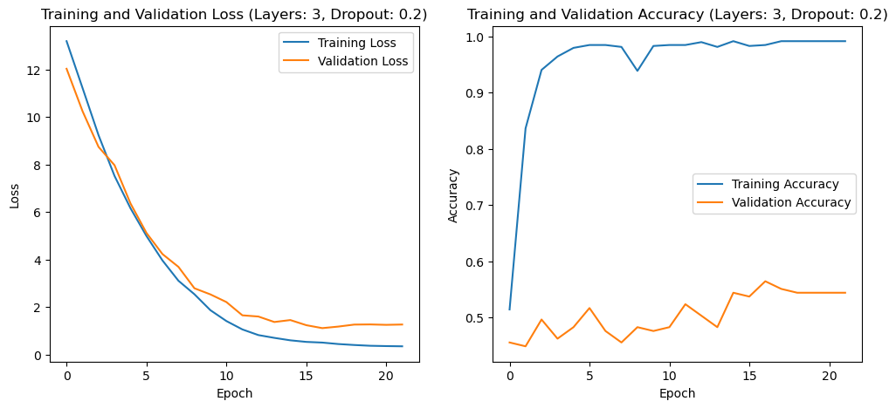

# Urdu Sentiment Analysis Using Deep Learning

## Project Overview

This project employs deep learning models to conduct sentiment analysis on a dataset of Urdu tweets, aiming to classify them into positive or negative sentiments. Using advanced neural network architectures like RNN, GRU, LSTM, and BiLSTM, and exploring the impact of different word embeddings like Word2Vec, GloVe, FastText, and ELMo, the study delves deep into the nuances of natural language processing for Urdu, a language rich in cultural context and linguistic nuances.

## Installation

Before running the project, ensure the following libraries are installed:

```bash
pip install pandas scikit-learn tensorflow nltk gensim bilm matplotlib
```

## Data Preparation

The dataset comprises Urdu tweets, preprocessed by removing non-Urdu characters and tokenized to fit the models' input requirements. Tweets labeled 'O' (indicating other sentiments) are dropped to focus the analysis on positive and negative sentiments only.

## Model Implementation

We implemented a suite of neural network architectures:

- **Recurrent Neural Network (RNN)**: A basic RNN structure to capture sequence information.
- **Gated Recurrent Unit (GRU)**: An RNN variant that can carry information across many time steps.
- **Long Short-Term Memory (LSTM)**: Advanced RNN capable of learning long-term dependencies.
- **Bidirectional LSTM (BiLSTM)**: Extends LSTM by providing additional context from future states.

Each model is configured with varying layers (2 or 3) and dropout rates (0.3, 0.5, or 0.7) to understand the effects of depth and regularization on performance.

## Hyperparameters and Regularization

To combat overfitting, L1 and L2 regularization strategies are employed, and hyperparameters are fine-tuned using callbacks like EarlyStopping and ReduceLROnPlateau.

## Training and Evaluation

The dataset is split into a 75-25 train-test ratio. Models are compiled using the Adam optimizer and binary cross-entropy loss function due to the binary nature of our classification task. Each model's training process is visualized using plots of loss and accuracy over epochs.

## Results

Best-performing models' parameters and their accuracies are reported. The effectiveness of each embedding technique in conjunction with the BiLSTM model is also evaluated. Overall, BiLSTM outperforms all other models given the simplicity and straightforward

## Visualizations

Plot images from the training sessions, showcasing the trends in accuracy and loss, are included in the repository. The visualizations help to quickly gauge the models' learning progress and compare the effectiveness of different hyperparameters and embeddings.



## Usage

To replicate the findings, follow the notebook sequentially, ensuring the dataset is in the correct directory.

## Acknowledgements

The dataset used in this project is obtained from the Urdu Sentiment Corpus. Special thanks to the creators of the dataset and the developers of the libraries used in this project.
